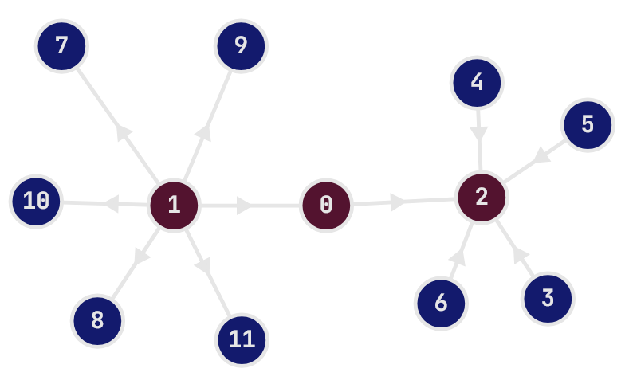

import { ContestProblemStatus } from '@/components/seraph/contest-problem-status'
import Callout from '@/components/Callout.astro'

---

<ContestProblemStatus
  solved={['A', 'B', 'C']}
  failed={['D']}
  count={6}
  contestId={2112}
/>

---
## Problem A
<Callout variant="observation">
If $$x \le a \le y$$ or $$y \le a \le x$$, then Bob might lose, because the prize could show up on the "opposite side" of Alice. 
In other words, if both $$x$$ and $$y$$ are on the same side of $$a$$, then Bob can always win by choosing the side that contains the prize.
</Callout>

That's the only observation needed. The time complexity is $$O(1)$$.

```cpp title="a.cpp" showLineNumbers"
void shiina_mashiro() {
    int a, b, c; cin >> a >> b >> c;
    if(a < b && a < c) {
        cout << "Yes" << nl;
        return;
    }
    if(a > b && a > c) {
        cout << "Yes" << nl;
        return;
    }
    cout << "No" << nl;
}
```

## Problem B
I thought I solved it immediately, so I coded it up in 2 minutes and instantly got WA. This is probably reducible to less cases, but 
I didn't think too much.

<Callout variant="observation">
1. If there already exists an $$i$$ such that $$|a_i - a_{i+1}| \leq 1$$, then clearly the answer is 0.
2. If there is no such $$i$$, then we have to make sure the array is not strictly increasing or decreasing. There's many ways to check this,
    but I just checked if there exists an $$i$$ such that $$a_i$$ is between $$a_{i+1}$$ and $$a_{i+2}$$, or vice versa.
3. As long as it's not strictly increasing or decreasing, the answer is 1, because for example $$3,2,4$$, we can convert to $$3,3$$, i.e.
convert to whichever number is sandwiched between the other two. 
</Callout>
Time complexity is $$O(n)$$.

```cpp title="b.cpp" showLineNumbers"
void shiina_mashiro() {
    int n; cin >> n;
    vector<int> vi(n);
    for(int i = 0; i < n; i++) cin >> vi[i];

    int ok = 0;
    for(int i = 0; i < n-1; i++) {
        if(abs(vi[i+1]-vi[i]) <= 1) ok = 1;
    }
    if(ok) {
        cout << 0 << nl;
        return;
    }
    int ok2 = 0;
    for(int i = 0; i < n-2; i++) {
        if(min(vi[i], vi[i+1]) <= vi[i+2] && max(vi[i], vi[i+1]) >= vi[i+2]) ok2 = 1;
        if(min(vi[i+1], vi[i+2]) <= vi[i] && max(vi[i+1], vi[i+2]) >= vi[i]) ok2 = 1;
    }
    if(!ok2) {
        cout << -1 << nl;
        return;
    }
    cout << 1 << nl;
}
```

## Problem C


<Callout variant="observation">
Let's say Alice pick 3 numbers where $$x \leq y \leq z$$. So Bob can try to sabotage and pick $$z$$, so we must ensure $$x + y > z$$.
Otherwise, if $$z$$ isn't the largest number in the array, Bob can always pick $$\max(A)$$, so also have to ensure $$x + y + z > \max(A)$$.

We need to try finding this below $$O(n^3)$$, so fix the smallest number $$x$$. Then $$y$$ and $$z$$ can be found using two pointers.
</Callout>

Time complexity is $$O(n^2)$$.
```cpp title="c.cpp" showLineNumbers"
void shiina_mashiro() {
    int n; cin >> n;
    int mx = 0;
    vector<int> vi(n);
    for(auto&a: vi){
        cin >> a;
    } 
    
    int ans = 0;
    for(int i = 0; i < n; i++) for(int j = i+1, L = n-1, R = j+1; j < n; j++) {
        ckmax(L, j+1);
        while(L-1 > j && vi[i] + vi[j] + vi[L-1] > vi[n-1]) {
            L--;
        }
        ckmax(R, j+1);
        while(R < n && vi[i] + vi[j] > vi[R]) {
            R++;
        }
        ans += max(0LL, R-L);
    }
    cout << ans << nl;
}
```

## Problem D

I got WA 9 times... on this problem and another 4 times after failing to solve in contest. I think this is a classic "not thinking clearly enough".
It was pretty obvious that if we alternate the direction of the edges, we will get $$n-1$$ paths.

Originally I thought we need to find a degree 1 vertex and simply flip aim that edge. Idk why but I assumed the tree is rooted, and kept
incorrectly counting the number of paths, but you can pretty easily verify that this is a wrong idea. 

Then I realized for a degree 2 vertex, you could aim them in the same direction and it would add exactly 1 path, i.e.
$$u \rightarrow v \rightarrow w$$, but somehow I was stuck in the first idea, so I thought either $$u$$ or $$w$$ needed to be degree 1. 
I couldn't implement either, so I kept trying some weird ways of rooting the tree. 

<Callout variant="observation">
Find any degree 2 vertex, and root the tree there. For it's left and right subtree, alternate the direction of the edges, and make sure their ith layer 
is flipped compared to the other subtree.

</Callout>

Time complexity is $$O(n)$$.
```cpp title="d.cpp" showLineNumbers"
void shiina_mashiro() {
    int n; cin >> n;
    vector<vector<int>> adj(n);
    for(int i = 0; i < n-1; i++) {
        int u, v; cin >> u >> v;
        --u; --v;
        adj[u].pb(v);
        adj[v].pb(u);
    }
    if(n==2) {
        cout << "No" << nl;
        return;
    }
    int root = -1;
    for(int i = 0; i < n; i++) {
        if(sz(adj[i]) == 2) {
            root = i;
            break;
        }
    }
    if(root == -1) {
        cout << "No" << nl;
        return;
    }
    vector<pii> ans;
    auto dfs = [&](auto &&s, int u, int p, int f) -> void {
        if(f&1) ans.pb({u, p});
        else ans.pb({p, u});
        for(auto&e: adj[u]) if(e != p) {
            s(s, e, u, f^1);
        }
    };
    dfs(dfs, adj[root][0], root, 0);
    dfs(dfs, adj[root][1], root, 1);
    cout << "Yes" << nl;
    for(auto &[a, b] : ans) {
        cout << a+1 << " " << b+1 << nl;
    }
}
```